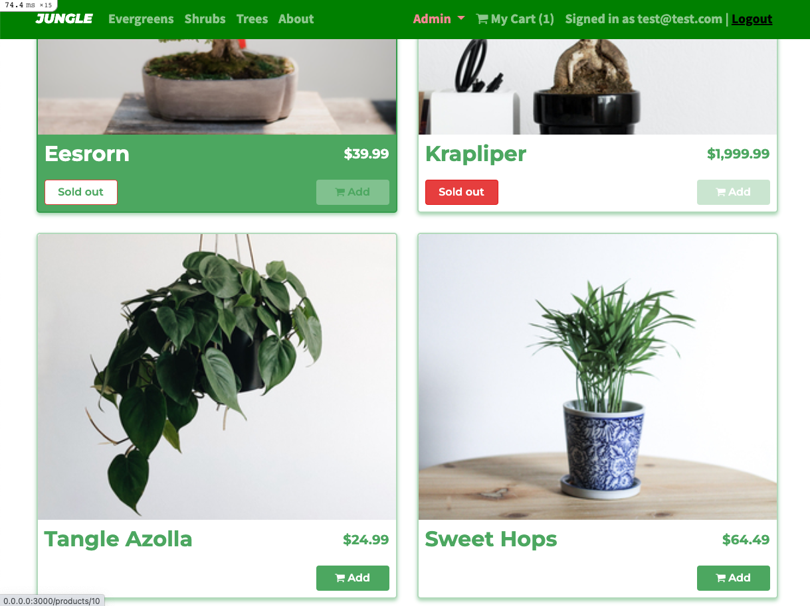
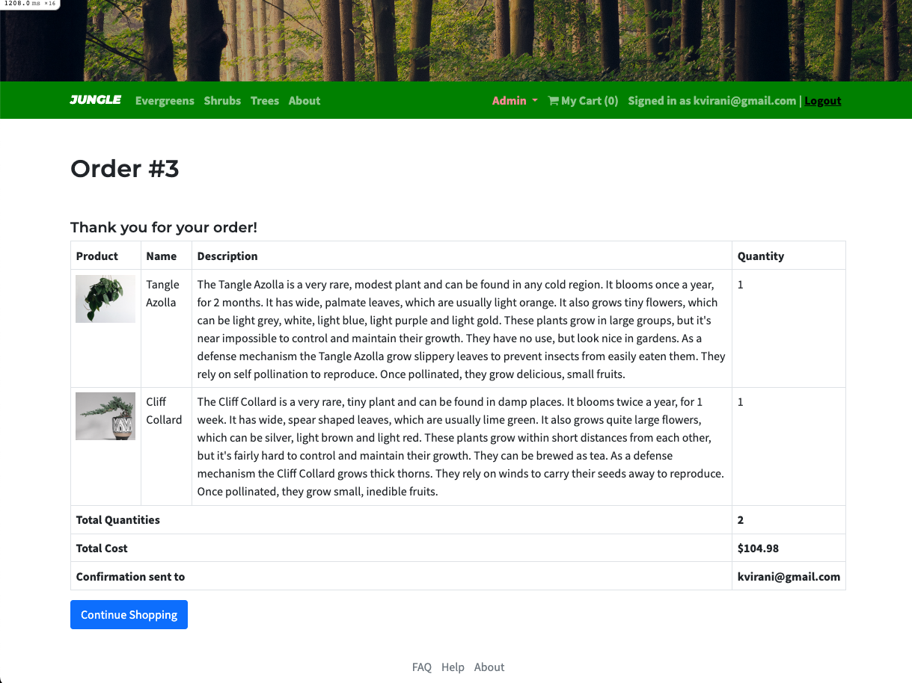
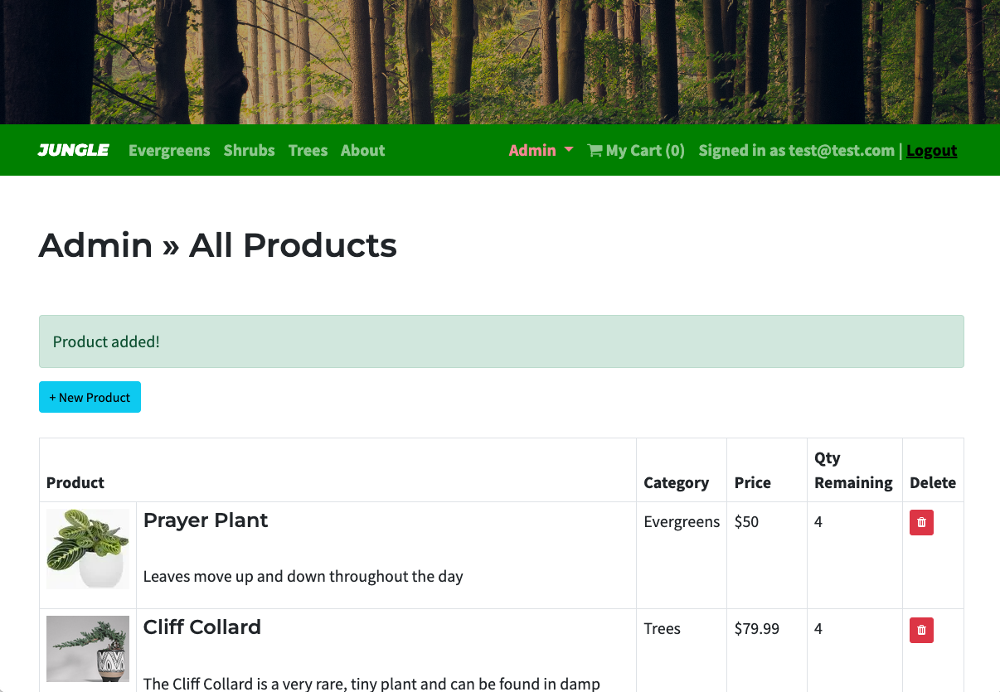
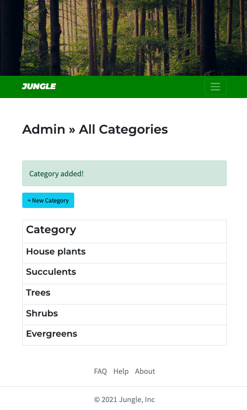
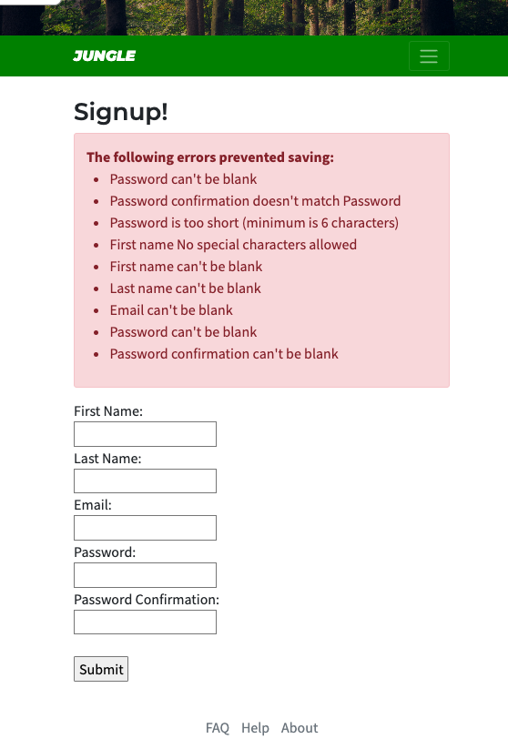

# Jungle

A mini e-commerce application built with Rails 6.1 for purposes of teaching Rails by example.

Integration testing with RSpec and End-to-End with Cypress.

---
## Final Product

---

## Contents
1. [Models](/app/models)
2. [Views](/app/views)
3. [Controllers](/app/controllers)
4. [RSpec tests](/spec/models)
5. [Routes](/config/routes.rb)

---

## Getting Started

1. Clone this repository onto your local device.
2. Run `bundle install` to install dependencies
3. Create `config/database.yml` by copying `config/database.example.yml`
4. Create `config/secrets.yml` by copying `config/secrets.example.yml`
5. Run `bin/rails db:reset` to create, load and seed db
6. Create .env file based on .env.example
7. Sign up for a Stripe account
8. Put Stripe (test) keys into appropriate .env vars
9. Run `bin/rails s -b 0.0.0.0` to start the server

---

## Database

If Rails is complaining about authentication to the database, uncomment the user and password fields from `config/database.yml` in the development and test sections, and replace if necessary the user and password `development` to an existing database user.

---

## Stripe Testing

Use Credit Card # 4111 1111 1111 1111 for testing success scenarios.

More information in their docs: <https://stripe.com/docs/testing#cards>

---

## Dependencies

- Rails 6.1 
- Bootstrap 5
- PostgreSQL 9.x
- Stripe
- Webpack

---
### Acknowledgements

Template provided by LightHouse Labs. The master branch can be found [here](https://github.com/lighthouse-labs/jungle-rails).